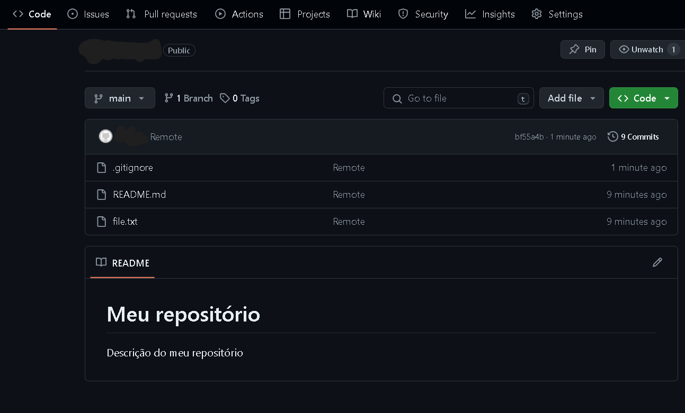

# GitHub

[Anterior: Branch](Branch.md)
[Próximo: Colaboração](Colaboração.md)

## O que é GitHub?

GitHub é uma plataforma online que hospeda projetos de software a partir do sistema Git. No GitHub, é possível colaborar com outros desenvolvedores, manter controle de suas alterações, versionar projetos, dentre muitas outras coisas.

Entre os principais recursos do GitHub, temos:
- **Issues**: ferramentas para busca de bugs e melhoria de código;
- **Pull Requests**: solicitações de alteração de código (via merge ou não), precedidas por revisões e discussões acerca das implicações da mudança no código;
- **Actions**: fluxos de trabalho no desenvolvimentos, como testes e deploys.

Além de todos esses pontos, o GitHub ainda funciona como uma "rede social de programadores", na qual usuários podem seguir e compartilhar seus repositórios, colaborem de qualquer lugar do mundo e favoritem projetos.

## Iniciando no GitHub

Para acessar o GitHub, é necessário [criar uma conta](https://github.com/signup). Ao entrar no site, será pedido que você:
- **digite um email válido**;
- **crie uma senha (precisa ser forte)**;
- **crie um nome de usuário (username)**.

Este último requer atenção, pois será "a sua cara" no GitHub. Anote as credenciais, e clique em continuar. Haverão alguns enigmas para validar que você é uma pessoa real, e um código será enviado ao email que você disponibilizou (por isso tem que ser válido).

Após isso, sua conta será criada e você será enviado para a tela de login, na qual basta entrar com os dados que você colocou.


*Tela de login GitHub*

## Criando um repositório

Após centrar na sua conta GitHub, você será redirecionado para seu dashboard. Aqui aparecerão informações  sobre você, notícias interessantes ou notificações acerca das pessoas que você segue.


*DashBoard GitHub*

Para criar um repositório, basta clicar em "Criar repositório", ou no "+" (ambos destacados em amarelo). Você será levado a essa página:


*Página de criação de repositório*

Vamos destrinchar os campos demonstrados:
- **Nome do Repositório**: Aqui você nomeia o repositório. Não pode ser um nome de um repositório seu já existente;
- **Descrição**: Opcional;
- **Visibilidade**: Seu repositório pode ser **público** ou **privado**. É possível alterar depois;
- **Adicionar arquivo README**: O arquivo README.md é um arquivo padrão do GitHub que serve de porta de entrada para seu repositório. Quando alguém acessa a página principal, esse arquivo é exibido.
- **Adicionar .gitignore**: Veremos isso melhor mais abaixo.
- **Escolher licença**: Aqui você decide como os outros podem interagir com seu código.

> [!WARNING]
> Neste tutorial, o repositório precisa ser público

Depois de preencher todos os campos, clique em "Criar repositório", e ele será criado. Você será redirecionado para a página principal de seu repositório. 

Agora vamos aprender a conectar nosso repositório local com o online.

## Local para GitHub

Voltando ao nosso exemplo anterior, precisaremos fazer algumas alterações. Primeiro, troque o nome do branch principal de `master` para `main`:

```bash
git branch -m main
```

> [!NOTE]
> É uma convenção da comunidade GitHub chamar o branch principal de `main`

Crie agora um arquivo chamado `README.md`, com o seguinte código:

```markdown
# Meu repositório

Descrição do meu repositório
```

Crie também um arquivo chamado `.gitignore`, e digite nele o seguinte:

```.gitignore
file2.txt
```

Após essas alterações, adicione tudo ao `index`, e faça um commit.

#### Git remote

Agora, usaremos alguns comando relacionados ao GitHub. Primeiro, para mandarmos as alterações para o nosso repositório online, precisamos definir nossa `origin`: o repositório de destino dos nossos comandos. Para isso, use:

```bash
git remote add origin https://github.com/<seu-username>/<nome-repositorio>
```

Substitua as partes do link corretamente, caso contrário, não funcionará. Lembrando que o repositório deve estar público.

### Push

Agora que tudo está pronto, podemos mandar o commit atual para nosso repositório. Para isso, usaremos o seguinte comando:

```bash
git push -u origin main
```

>[!TIP]
>O `-u` é abreviação para `--set-upstream`, e é usado para criar no repositório online um branch equivalente ao especificado (nesse caso o `main`). 
>Após a primeira vez, basta usar `git push origin`, e vai funcionar.

### Credenciais

Quando você rodar esse comando, deve aparecer uma tela parecida com essa:


*Tela de login Git*

Isso acontece porque, para fazer alterações (pushes) em repositórios GitHub é necessário estar logado. Basta clicar em "*Sign in with your browser*" e fazer o login normalmente. 

Ainda sobre credenciais, é importante configurar seus dados de usuário. Para isso, execute os seguintes comandos:

```bash
git config --global user.name "<seu-username>"
git config --global user.email "<seu-email-github>"
```

Assim, o Git saberá quem você é.
### Dashboard

Se tudo ocorreu bem, suas alterações serão enviadas para seu repositório. Ao acessá-lo agora, você verá uma imagem parecida com a abaixo:


*Dashboard do repositório*

Nesta imagem, podemos ver:
- os arquivos do repositório padrão (`main`, nesse caso);
- note que `file2.txt` não está lá. Isso aconteceu porque o colocamos no `.gitignore`: arquivo que define quem o Git deve ignorar na hora do push;
- o arquivo README.md que escrevemos é exibido de cara.

## Conclusão

Por fim, criamos uma conta no GitHub, e aprendemos a criar um repositório online e alterá-lo localmente. Ainda temos mais um pouco de GitHub no próximo tópico.

[Anterior: Branch](Branch.md)
[Próximo: Colaboração](Colaboração.md)