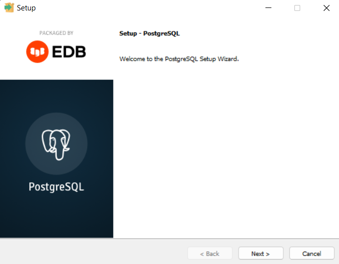
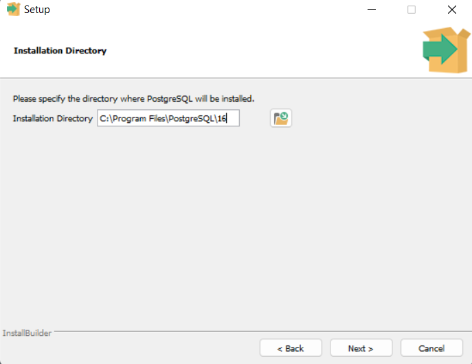
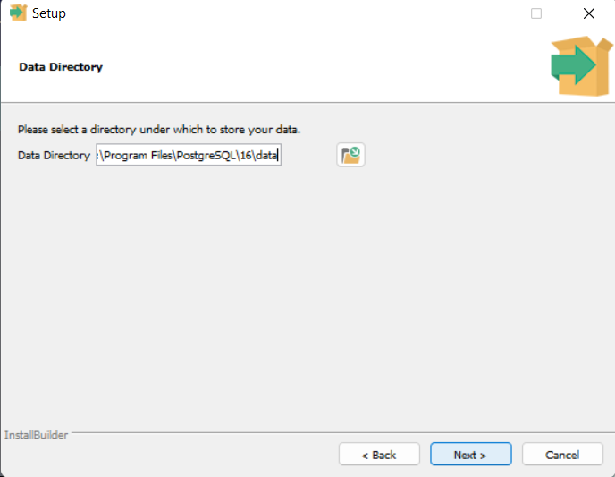
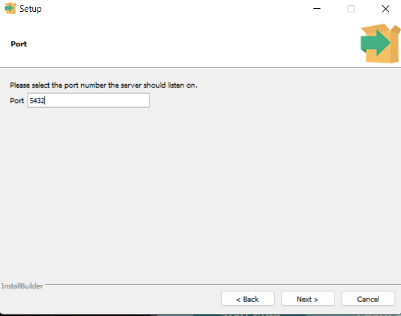

# Instalação

[Anterior: Introdução](README.md)

Para instalar o PostgreSQL em sua máquina, utilize [este link](https://www.enterprisedb.com/downloads/postgres-postgresql-downloads) e siga o passo a passo específico para seu sistema operacional. Aqui documentarei a instalação do PostgreSQL 16.3 no Windows 11 (meu sistema operacional).

## No Windows

Após instalar e rodar o instalador, você deve encontrar as seguintes páginas:

1. **Página inicial**: Clique em *Next* para iniciar a instalação.

2. **Diretório de instalação**: Não alteraremos o caminho. Clique em *Next* novamente.

3. **Selecionar componentes**: Aqui selecionaremos todos, exceto o Stack Builder (interface gráfica para instalação de módulos extras). Clique em *Next*.

4. **Diretório de dados**: Não alteraremos o caminho novamente. Clique em *Next* novamente.

5. **Senha do superuser**: **Importante: crie e anote a senha para não esquecer**. Lembre de redigitar a senha no segundo campo. Ao criar a senha, Clique em *Next*.

6. **Porta**: Deixaremos a 5432, pois é a convencional. Clique em *Next*.

7. A partir daqui, aparecerão mais algumas telas, mas basta clicar em *Next* em todas, até que a instalação inicie.

Após tudo isso, teremos instalado os componentes necessários para nosso tutorial.

## Componentes instalados

Como visto no passo (3), instalamos três componentes diferentes nessa instalação.

### PostgreSQL Server

É o núcleo do PostgreSQL. Ele que manipula os bancos de dados e faz toda a mágica acontecer.

### pgAdmin

O pgAdmin é uma interface gráfica de administração própria para o PostgreSQL, cuja função é facilitar o gerenciamento e uso do SGBDR a partir de visualização gráfica.

### Command Line Tools

Como o nome sugere, consiste numa *Command Line Interface* (CLI) cujos comandos estão voltados para o gerenciamento e uso do SGBDR por meio do terminal. A CLI está disponível a partir do aplicativo SQL Shell.

## Conclusão

Agora que está tudo instalado, vamos por a mão na massa!

[Próximo: Configurando](Configurando.md)
